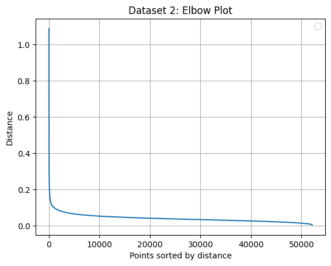

Note: Share.ipynb includes the entire Homework.
I also uploaded 3 separate versions to separate the tasks.

TASK 1:
Dataset 1 Estimated Ground Level: 61.269

Dataset 2 Estimated Ground Level: 61.233

TASK 2:
Dataset 1 elbow plot

Looking at the elbow plot, I eyeballed it and chose an eps value of 0.16.

Dataset 2 elbow plot

Looking at the elbow plot, I eyeballed it and chose an eps value of 0.155.

Dataset 1 estimated optimized value for eps: optimal_eps=0.16

I messed with the eps value until I could see the clearest separation between clusters. 17 clusters seemed to be a good number that allowed enough separation between the trees and the catenary.

Dataset 2 estimated optimized value for eps: optimal_eps=0.155

I messed with the eps value until I could see the clearest separation between clusters. 13 clusters seemed to be a good number that allowed enough separation between the trees and the catenary.

TASK 3:
Dataset 1 Catenary cluster

Catenary cluster X range: 26.497999999992317 to 62.14000000001397
Catenary cluster Y range: 80.01900000032037 to 159.95999999996275

Dataset 2 Catenary cluster

Catenary cluster X range: 7.9390000000130385 to 37.00700000001234
Catenary cluster Y range: 0.009999999776482582 to 79.97599999979138
